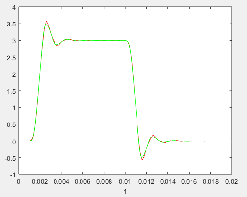
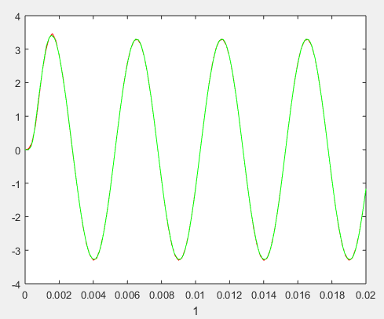
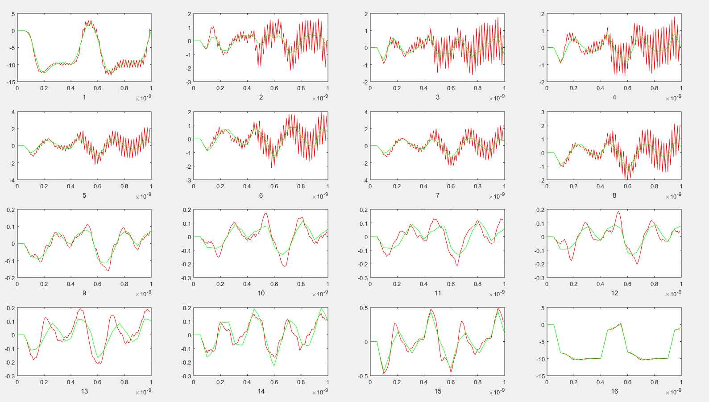
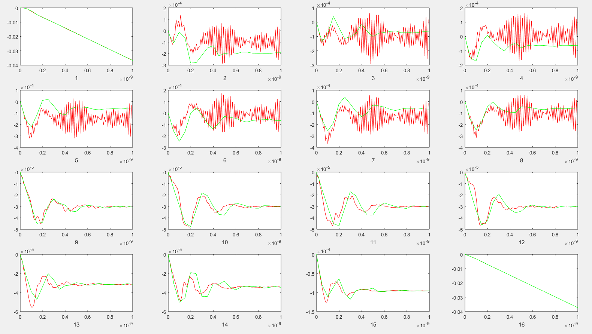
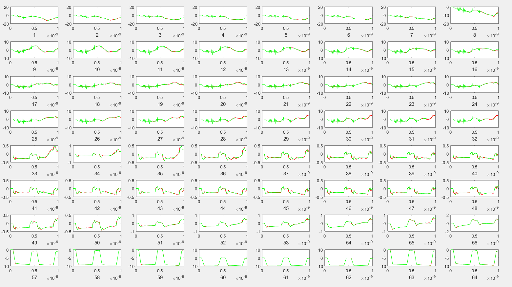
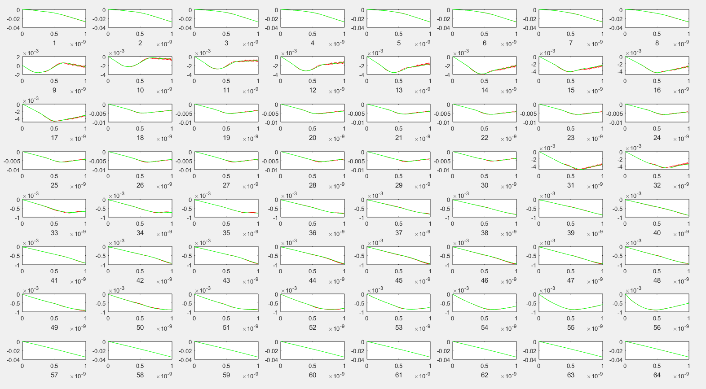

# 现代集成电路分析方法 Project 345

23212020011 罗咏瀚 2023年12月16日

## 文件结构

主目录为Project345，实现了梯形法求解电路MNA方程，求解方法实现了直接法（部分主元法，使用ipiv隐式地交换行）、Jacobi/G-S/SOR迭代法以及GCR法，但是四种迭代法在复杂例子中收敛慢（固定较少的迭代次数时精度差）、运行时间长，所以最后使用直接法求解。  

* /Benchmark 测试用例、提供的测试程序以及hspice仿真结果
* solve.m 直接法（部分主元法）、Jacobi/G-S/SOR迭代法以及GCR法的实现
* solve_test.m 上述实现的测试，主要用于验证迭代法
* getsrcv.m 生成所有所需时间点的激励向量（乘B可得到真正的右端项）
* main.m 主程序
* README.md及图片 说明文档

## 实验结果

红色为程序模拟结果，绿色为hspice模拟结果。  
程序模拟的点数只取100个记为向量V，hspice的结果也取对应的100个点记为向量V0.  
相对误差为||V-V0|| / ||V0||  

### RLC_s3 脉冲

相对误差0.0108  

### RLC_s3 正弦

相对误差0.0094  

### bus8bit8seg 脉冲

相对误差（每个输出）：  
0.1151, 1.9609, 2.1189, 1.8946,  
1.5229, 1.3360, 1.3743, 1.5106,  
0.3291, 0.6030, 0.7353, 0.6274,  
0.8560, 0.4136, 0.4324, 0.0200.  

### bus8bit8seg 正弦

相对误差（每个输出）：  
0.0046, 0.6689, 1.1738, 1.4211,  
1.3500, 1.0817, 1.0770, 0.9412,  
0.0634, 0.1124, 0.1565, 0.1265,  
0.1761, 0.1503, 0.0757, 0.0007.

### bus32seg16 脉冲

相对误差（每个输出）：  
0.1018, 0.0976, 0.0904, 0.0934, 0.0977, 0.0953, 0.0959, 0.0985,  
0.2676, 0.2656, 0.2745, 0.2848, 0.3024, 0.3234, 0.3432, 0.3574,  
0.3664, 0.3695, 0.3613, 0.3494, 0.3411, 0.3259, 0.3130, 0.3037,  
0.3002, 0.3032, 0.3096, 0.3186, 0.3246, 0.3308, 0.3345, 0.3375,  
0.1840, 0.1760, 0.1597, 0.1619, 0.1648, 0.1588, 0.1492, 0.1444,  
0.1456, 0.1494, 0.1477, 0.1488, 0.1327, 0.1275, 0.1252, 0.1161,  
0.1076, 0.1040, 0.0955, 0.1052, 0.1110, 0.0947, 0.0653, 0.0569,  
0.0102, 0.0107, 0.0107, 0.0112, 0.0112, 0.0108, 0.0111, 0.0104.  

### bus32seg16 正弦

相对误差（每个输出）：  
0.0160, 0.0117, 0.0105, 0.0105, 0.0112, 0.0109, 0.0140, 0.0141,  
0.1523, 0.1041, 0.0772, 0.0613, 0.0541, 0.0454, 0.0598, 0.0355,  
0.0361, 0.0317, 0.0354, 0.0386, 0.0355, 0.0303, 0.0312, 0.0303,  
0.0353, 0.0353, 0.0343, 0.0410, 0.0410, 0.0383, 0.0397, 0.0513,  
0.0337, 0.0287, 0.0194, 0.0168, 0.0163, 0.0092, 0.0108, 0.0165,  
0.0087, 0.0175, 0.0167, 0.0269, 0.0256, 0.0241, 0.0155, 0.0119,  
0.0135, 0.0192, 0.0109, 0.0164, 0.0088, 0.0090, 0.0070, 0.0062,  
0.0009, 0.0005, 0.0003, 0.0003, 0.0005, 0.0003, 0.0007, 0.0012.  
