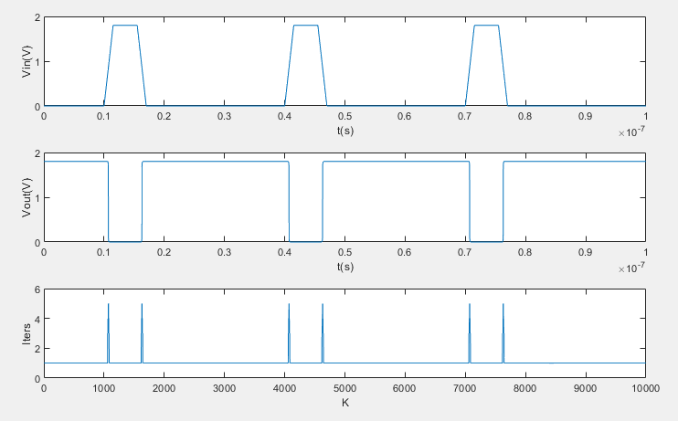
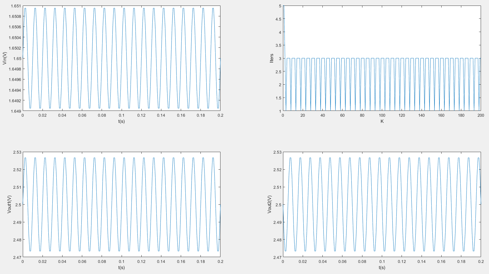

# 现代集成电路分析方法 Project 6

23212020011 罗咏瀚 2023年12月18日  

反相器仿真的运行脚本为run_inv.m，放大器仿真的运行脚本为run_amp.m  

由于每次迭代都需要F和J，且其值会不断发生变化，因此在迭代开始前，先使用matlab的符号计算功能定义它们的符号版本f和j（包含确定的MOS管/电路参数，以及未确定的符号变量Vout_s和Vin_s）。例如反相器中，f定义为一个分段函数（反相器的输入输出曲线），j由f对符号Vout_s求导得到。  

```text
syms Vout_s Vin_s;
...
f = piecewise(...
    Vin_s < Vthn,                           0 - Id_p_line, ...
    Vthn <= Vin_s < Vout_s + Vthp,          Id_n_sat - Id_p_line, ...
    Vout_s + Vthp <= Vin_s < Vout_s + Vthn, Id_n_sat - Id_p_sat, ...
    Vout_s + Vthn <= Vin_s < Vdd + Vthp,    Id_n_line - Id_p_sat, ...
    Vdd + Vthp <= Vin_s,                    Id_n_line - 0 ...
    );
j = diff(f, Vout_s);
```

此后在每个时间点进行若干次迭代，每次迭代中，首先沿用上个时间点的Vout值（若为第一个时间点则手动指定Vout初始值），然后利用subs函数将具体的Vout和Vin数值代入f和j中，就可以得到F矩阵和J矩阵并对Vout进行迭代。  

```text
Vout(:,1) = ...;     % k=1时刻的Vout初始值 
for k = 1 : N+1
    Vin(k) = src_...((k-1)*dt);    % 计算k时刻的Vin
    iter = 0;      
    while iter < max_iter
        F = subs(f, [Vout_s;Vin_s], [Vout(:,k);Vin(k)]);    % subs得到F
        if (norm(F) < max_error)
            break;  % 收敛
        end
        J = subs(j, [Vout_s;Vin_s], [Vout(:,k);Vin(k)]);    % subs得到J
        Vout(:,k) = Vout(:,k) - J \ F;  % 迭代更新Vout
        iter = iter + 1;             
    end
    num_nt_iters(k) = iter;
    Vout(:,k+1) = Vout(:,k);    % k时刻的最终Vout作为k+1时刻的初始Vout 
end
```

运行结果如下。  

## 反相器



## 放大器

