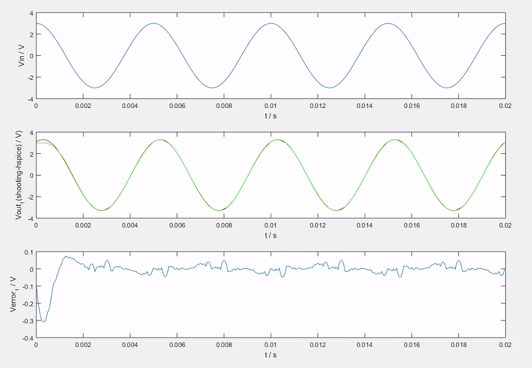
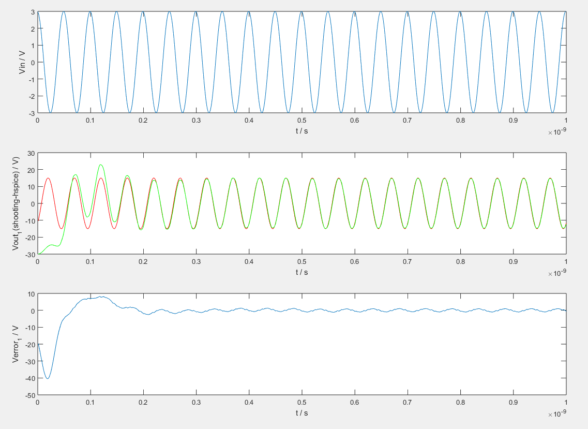
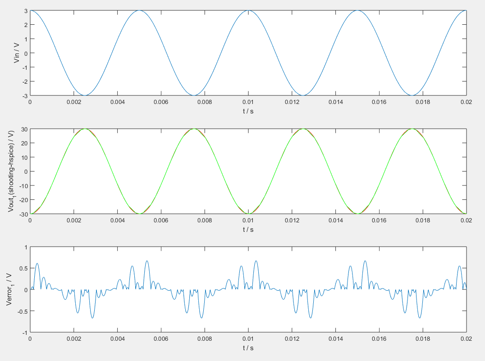

# 现代集成电路分析方法 Project 7

23212020011 罗咏瀚 2023年12月26日  

主程序为main.m，此外getsrcv.m用于得到各时刻的输入电压值。  

主程序中用FILE的值指定仿真的电路，目前实现了三个电路的sin激励的稳态相应。由于打靶法需要保证仿真时间内，激励经过若干个周期，因此需要手动调节仿真时间与激励频率的关系（此外需要调整相位使其实际上变为余弦激励信号），具体而言：  

* RLC_s3：仿真时间2e-2，步长4e-6，共5000个点，激励信号周期5e-3  
* bus8bit8seg：仿真时间1e-9，步长1e-12，共1000个点，激励信号周期5e-11
* bus32seg16：同RLC_s3，主要原因是如果与bus8bit8seg设置相同，则Hspice仿真报错导致得不到参考结果

此后，程序分为两大部分。第一部分为用基于牛顿迭代的打靶法确认稳态解的初始值x(0)，在迭代过程中调整x(0)，使得x(0)和x(T)足够接近。第二部分则是在确定x(0)后，用后向欧拉法迭代得到整个仿真时间内的输出波形。  

在代码实现中，两部分均在x向量上进行，第一部分只会涉及到x向量开头的一段元素，而第二部分会更新x向量的所有元素。

实验结果如下，各图由上到下分别为：（第一个）输入波形；（第一个）打靶法（红）与Hspice仿真（绿）的输出波形；（第一个）输出波形的绝对误差。  

## RLC_s3

MSE：0.002648  

## bus8bit8seg

MSE：43.207989  

## bus32seg16

MSE：0.062276  
